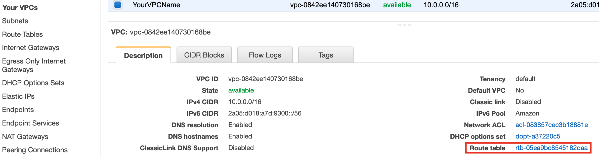
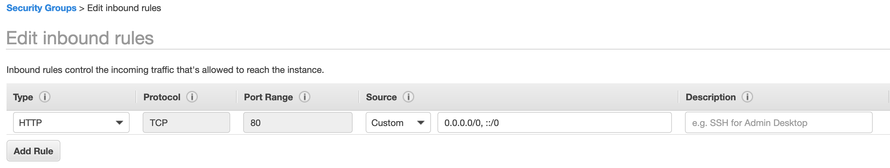

Module One: AWS Networking Core Concepts
==========

The workshop will guide you in configuring the following elements

* VPC
* Internet Gateway
* Elastic IP
* NAT Gateways
* Subnets (Private and Public)
* Route Tables
* Security Groups
* VPC Endpoints
* VPC Flow Logs

The following diagram represents the target set-up for this module 

## Virtual Private Cloud (VPC)
Amazon Virtual Private Cloud (Amazon VPC) lets you provision a logically isolated section of the AWS Cloud where you can launch AWS resources in a virtual network that you define. You have complete control over your virtual networking environment, including selection of your own IP address range, creation of subnets, and configuration of route tables and network gateways. You can use both IPv4 and IPv6 in your VPC for secure and easy access to resources and applications.

To get started, let’s take a look at the VPC Dashboard.  

In every region, a default VPC has already been created for you. So, even if you haven’t created anything in your account yet, you will see some VPC resources already there.

Select "Your VPCs" then Create VPC and fill the following form with your VPC Name and an IPv4 CIDR block.

## Subnet

A subnet is a segment of a VPC that resides entirely within a single Availability Zone. While a VPC spans all Availability Zones in a region, a subnet cannot span more than one Availability Zone.

Let's create the following subnets 

|Subnet Name|IP Range|Availability Zone|
|-----------|--------|-----------------|
|PublicSubnetOne|10.0.0.0/24|\<yourregion>-1a|
|PublicSubnetTwo|10.0.1.0/24|\<yourregion>-1b|
|PrivateSubnetOne|10.0.128.0/24|\<yourregion>-1a|
|PrivateSubnetTwo|10.0.129.0/24|\<yourregion>-1b|

In each subnet, AWS reserves 5 IP addresses. In this case, that leaves you 251 IP addresses per subnet.

Subnets can be configured through Subnets > Create Subnet

## Internet Gateway

An Internet Gateway is an horizontally scaled, redundant, highly available VPC component. 
It connects your VPC Subnets to the Internet. 

You can create the internet gateway through **Internet Gateways > Create Internet Gateway**

The internet gateway should then be attached to your VPC

Creating and attaching an Internet Gateway to our VPC is not enough to get internet traffic flowing from and to your VPC, for that we need to modify our routing and this is the topic of of the route table section.

## NAT Gateway

A NAT Gateway is an AWS Managed resource which enable outbound connection to the internet and prevents the instances from receiving inbound traffic initiated by someone on the internet.
A NAT Gateway is highly available within an Availability Zone. 

In this set-up we will create an AZ independent architecture and we will create one NAT Gateway per AZ.We will later configure our subnet route tables such that resources use the NAT gateway in the same AZ. 

Two NAT Gateway will be created and each will be associated to a different PublicSubnet

## Route Table

Each subnet within a VPC contains a logical construct called an implicit router. The implicit router is the next hop gateway on a subnet where routing decisions are made.  These routing decisions are governed by a route table, which include a set of route entries.

Select the VPC that you just created, and look at the Summary tab. If you can’t see everything in the pane, you can pull the pane up by dragging on the pane’s top line. 

In the Summary tab in the left-hand column, you can see the Main Route Table for your VPC. Any subnets in the VPC that do not have a route table directly associated with it will use this route table by default. To explore this further, click on the **Route table link**.

You are now in the Route Tables dashboard, filtered on the main route table of the VPC you just created. That means that there should be only one route table shown. Select this route table and click on the Subnet Associations tab.

You can see that there are no explicit subnet associations on this route table. However, since this is the main route table for the VPC, all subnets are implicitly associated.

In the Routes tab, look at the Target column. You’ll see one local route which every route table has. This ensures that resources within the VPC can talk to each other. This route cannot be modified.

In this lab we will create three additional custom route tables and associate the subnets we have created as follows

|Custom route table name|Associated Subnet Names|
|---|---|
|PublicRouteTable|PublicSubnetOne   PublicSubnetTwo|
|PrivateRouteTable-1a|PrivateSubnetOne|
|PrivateRouteTable-1b|PrivateSubnetTwo|

 

Each new route table created has an entry for the defined VPC CIDR range and we will add specific default routes to each one.

|Custom route table name|route entry | next hop|
|---|---|---|
|PublicRouteTable|0.0.0.0/0| \<your VPC InternetGateway>|
|PrivateRouteTable-1a|0.0.0.0/0|\<your NatGateway for AZ 1a>|
|PrivateRouteTable-1b|0.0.0.0/0|\<your NatGateway for AZ 1b>|

## Security Group

A Security Group is a stateful virtual firewall that controls inbound and outbound network traffic to AWS Resources and Amazon EC2 Instances. All EC2 Instances are launched with a security group.
By default when you create a new security group no inbound traffic is allowed, until you add an inbound security rule, and an outbound rule is added that allows all outbound traffic

In this workshop we will create security groups for an hypothecial workload comprised of an HTTP LoadBalancer, Web Frontend, and a MySQL Database. We will also be planning for a Linux Bastion Host.

It is important to note that these Security Groups are solely used for the demo puporse and do not represent Best Practices !!!.

The security groups will be configured as such 

Security Group Name: LoadBalancerSG
|Direction|Port/Protocol|Src/Dest|
|---|---|---|
|Inbound|80/TCP(HTTP)|0.0.0.0/0(any)|
|Outbound|80/TCP(HTTP)|WebServerSG|

Security Group Name: BastionSG
|Direction|Port/Protocol|Src/Dest|
|---|---|---|
|Inbound|22/TCP(SSH)|MyIP*|
|Outbound|22/TCP(SSH)|10.0.0.0/16|

\* The setting MyIP will add the IP address you are using to connect to the AWS Console 

Security Group Name: WebServerSG
|Direction|Port/Protocol|Src/Dest|
|---|---|---|
|Inbound|80/TCP(HTTP)|LoadBalancerSG|
|Inbound|22/TCP(SSH)|BastionSG|
|Outbound|AllTraffic|AllTraffic|

Security Group Name: DatabaseSG
|Direction|Port/Protocol|Src/Dest|
|---|---|---|
|Inbound|3306/TCP|WebServerSG|
|Inbound|22/SSH|BastionSG|
|Outbound|AllTraffic|AllTraffic|

Security Group Configuration Steps

1) Create the security group 

2) Edit the inbound rules 

3) Edit the outbound rules (If required)

4) Edit the Name Tag 

## VPC Endpoints
A VPC endpoint enables you to connect your VPC privately to supported AWS services and VPC endpoint services without requiring an Internet Gateway or a NAT Gateway.  
There are two types of VPC Endpoints: Interface and Gateway.  
* Interface endpoints use an elastic network interface in your VPC with a private IP address that serves as an entry point for traffic destined to a suppported service. 
* Gateway endpoints use a route table target for a specified route in your route table for supported services. These services are currently Amazon S3 and DynamoDB.

In this lab we will create a gateway VPC Endpoints for the S3 Service 

And associate it with your Private Route tables and Private subnet only

At the end of this section your private route tables should look like this 

And your Public route table like this 

---------------------

                    Well done you have reached the end of Module One
