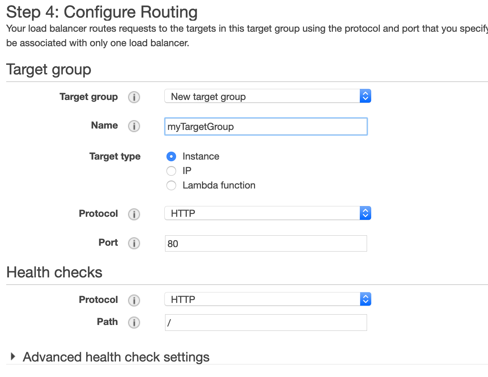

Module Two : Elastic Load Balancer
==========

!! Completion of [Core AWS Networking Module](ModuleOneCore.md) is a pre requisite for this module.

This Module will guide through the configuration of an Elastic Load Balancer.

AWS offers three types of Elastic Load Balancers

* Application Load Balancer or ALB
* Network Load Balancer or NLB
* Classic Loab Balancer 

Each type of ELB is suited to a particular [use case](https://aws.amazon.com/elasticloadbalancing/details/)

In this lab we will configure an Application Load Balancer which will be used to serve internet traffic. 

The following figure describes the ALB architecture

## ALB Configuration Steps

Elastic Load balancers are configured uunder the EC2 Service

Under the LoadBalancing menu 

Here are the configuration steps 

1) Create the Load Balancer and set-up the listener

We will be using an interner-facing loadbalancer and we will use the default HTTP Listerner

2) Associate your Load balancer with your VPC and Public Subnets

You can safely ignore the Security warning message

3) Associate your Load balancer with the LoadBalancer Security group configured in the Module One 

4) Create a new target group 

As we will use EC2 instances as targets the target type must be **Instance**

For this lab the Health checks  settings can be left at the default values.

You can skip the target registration as this will be done in your EC2 Lab :-) 

After a while you should see that your LoadBalancer transitioning from provisionning to active. The ELB will also get a DNS hostname assigned

---------------------

        Well done you have reached the end of Module Two
